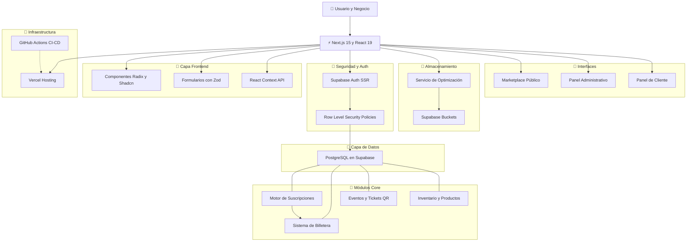
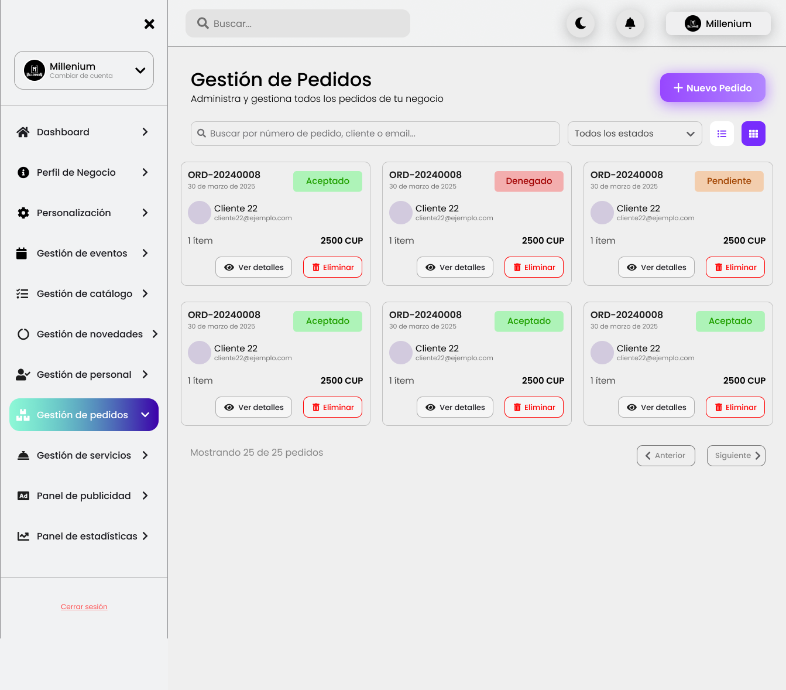
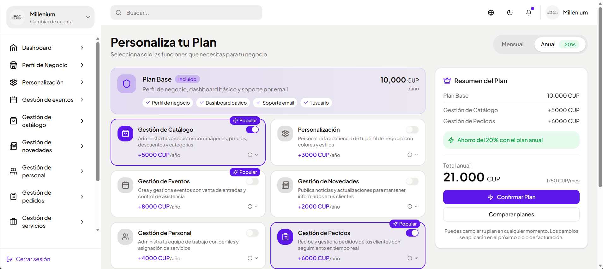
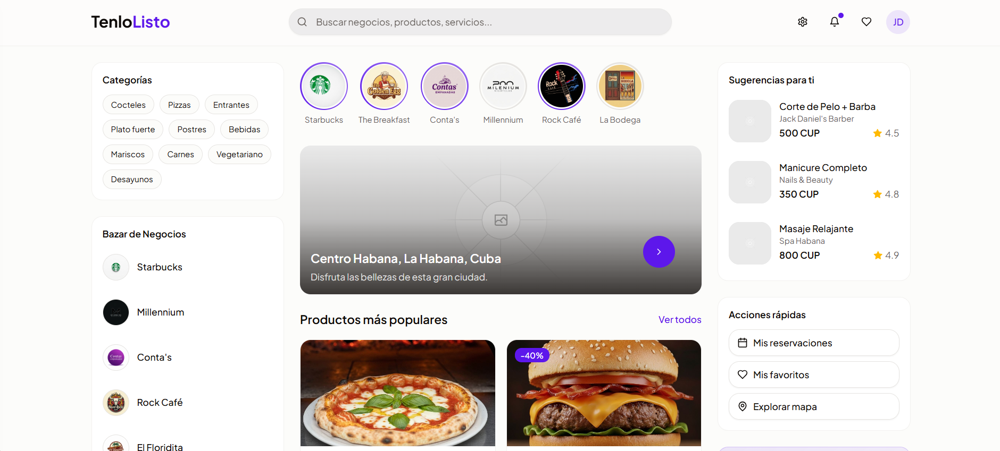
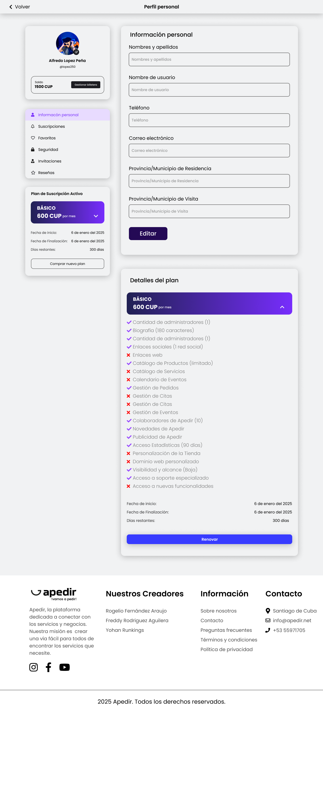

<div align="center">
  <h1>TenLoListo 🚀</h1>
  
  <h3>Plataforma SaaS & Marketplace para la Transformación Digital en Cuba</h3>

  <p>
    <b>B2B/B2C Solution • Next.js 15 • React 19 • Supabase • TypeScript</b>
  </p>

  <p>
    <a href="https://beta.tenlolisto.com">🌐 Live Demo (Website)</a> • 
    <a href="#-tech-stack">🛠️ Tech Stack</a> • 
    <a href="#-system-architecture">📐 Arquitectura</a>
  </p>

  <!-- Badges de estado -->
  
  
  
  
</div>

---

## 🎯 Sobre el Proyecto

**TenLoListo** es una solución integral diseñada para conectar negocios locales con usuarios, permitiendo descubrir productos, servicios y eventos de manera intuitiva. 

> **Nota Técnica:** Este repositorio (`TenloListo-Showcase`) documenta la arquitectura técnica y el progreso del proyecto. El código fuente del núcleo (`tenlolistocore`) es privado por razones comerciales y de Propiedad Intelectual.

### El Ecosistema Dual
1.  **Para Negocios (SaaS B2B):** Dashboard administrativo para gestión de inventario, activación/desactivación de productos, creación de eventos con tickets QR y analíticas.
2.  **Para Usuarios (Marketplace B2C):** Bazar digital con sistema de búsqueda, reservas, billetera virtual y social features.

---

## 📐 System Architecture

Diseño detallado de la infraestructura, flujo de datos y módulos de negocio.


---

## 🛠️ Tech Stack

| Capa | Tecnologías Clave |
|------|-------------------|
| **Frontend Core** | **Next.js 15.2.4** (App Router), **React 19**, TypeScript (Strict) |
| **UI System** | Tailwind CSS, Radix UI, Shadcn/ui, Lucide React |
| **Backend / DB** | **Supabase** (PostgreSQL, Auth, Edge Functions, Realtime) |
| **State & Forms** | React Context API, React Hook Form + Zod |
| **Features Pro** | Generación de PDFs, QR Codes, Optimización de Imágenes Custom |

---

## 📂 Estructura del Proyecto (Clean Architecture)

```bash
src/
├── app/                    # Next.js 15 App Router (Rutas y Layouts)
├── components/             # UI Components & Business Components
├── hooks/                  # Lógica reutilizable (use-subscription, use-cart)
├── lib/                    # Configuración de clientes (Supabase, Utils)
├── services/               # Capa de servicios para lógica de negocio pura
└── types/                  # Definiciones de TypeScript para el dominio
```
---

## 💡 Highlights Técnicos

### 1. Sistema de Suscripciones & Wallet 💳
Implementación de una lógica de pagos interna con billetera virtual. Los planes son dinámicos (configurados en base de datos) y las transacciones están protegidas por **Triggers de PostgreSQL** para asegurar la integridad de los datos.

### 2. Gestión de Eventos & QR 🎟️
Sistema capaz de generar tickets únicos en formato PDF con códigos QR dinámicos para el check-in de eventos, todo procesado en el lado del servidor/cliente de forma eficiente.

### 3. Seguridad a Nivel de Datos (RLS) 🛡️
Uso intensivo de **Row Level Security** en Supabase, garantizando que cada negocio solo pueda acceder a sus propios datos, cumpliendo con estándares de seguridad multi-tenant.

---

## 📸 Galería de Desarrollo

| Dashboard Admin | Planes de Suscripción |
|:---:|:---:|
|  |  |

| Vista Marketplace | Perfil de Usuario |
|:---:|:---:|
|  |  |

---

<div align="center">
  <p>
    <sub>Desarrollado con ❤️ y código limpio por <b>Yohan Ryuking</b>.</sub><br>
    <sub>© 2026 TenLoListo Core Architecture.</sub>
  </p>
</div>
